# Architecture

`hyperfocus` is a transparent wrapper around the real Claude Code CLI. It owns the terminal, watches
what the agent does through Claude Code hooks, and, while the agent is busy, swaps Claude's screen
for a quiz about the change being made. This document covers how the pieces fit together and why
they are shaped this way.

- [System overview](#system-overview)
- [Processes and boundaries](#processes-and-boundaries)
- [Modules](#modules)
- [Sequences](#sequences)
- [State machines](#state-machines)
- [Data model](#data-model)
- [Terminal handling](#terminal-handling)
- [Failure handling](#failure-handling)
- [Testing strategy](#testing-strategy)
- [Design decisions](#design-decisions)
- [Known limitations](#known-limitations)

## System overview

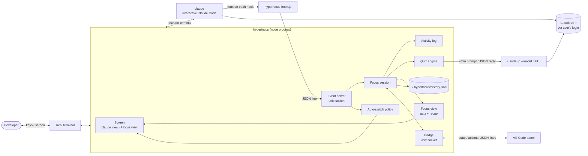

There are three kinds of process:

| Process | Lifetime | Role |
| --- | --- | --- |
| `hyperfocus` | the whole session | owns the real terminal, runs the logic |
| `claude` (interactive) | the whole session, child of hyperfocus in a PTY | the real Claude Code, unmodified |
| `hyperfocus-hook.js` | milliseconds, once per hook event | forwards one hook payload to hyperfocus |
| `claude -p --model haiku` | about 6s, once per question batch | writes the summary and questions |
| VS Code extension (optional) | while the editor is open | follows and drives the session through the [bridge](#the-panel-bridge) |

## Processes and boundaries

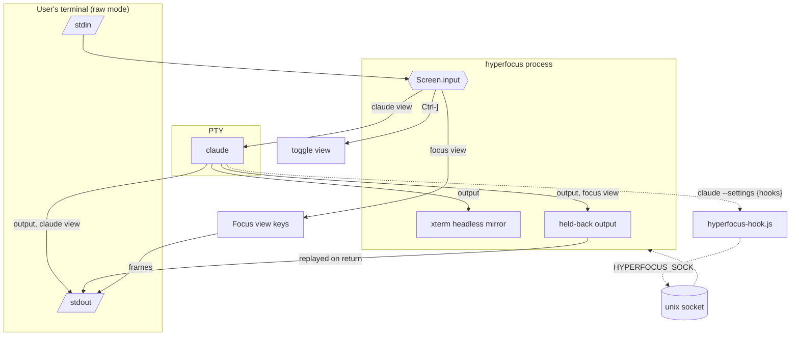

Where the boundaries are, and what crosses them:

| Boundary | Mechanism | Payload |
| --- | --- | --- |
| user ↔ hyperfocus | the real TTY in raw mode | keystrokes in, ANSI out |
| hyperfocus ↔ claude | `node-pty` pseudo-terminal | raw bytes both ways, plus resizes |
| claude → hyperfocus | Claude Code hooks → `bin/hyperfocus-hook.js` → unix socket | one JSON hook payload per line |
| hyperfocus → quiz model | `claude -p` subprocess | prompt on stdin, `--output-format json` on stdout |
| hyperfocus → disk | append-only file | one JSON line per answered question |

Hooks are injected with `claude --settings '<json>'`. Claude Code **merges** these with the user's
own settings files (verified: a project `Stop` hook and the injected one both fire), so hyperfocus never
writes to the user's configuration.

## Modules

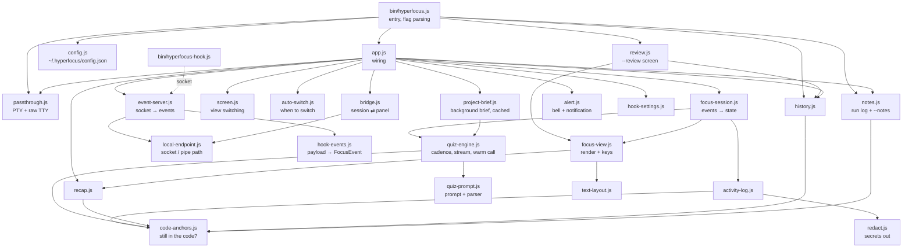

| Module | Responsibility | Tested at |
| --- | --- | --- |
| `bin/hyperfocus.js` | entry point: every flag (`--stats`, `--notes`, `--review`, `--doctor`, `--demo`, `--quiet --here`, hooks…), config problems, finding claude, TTY vs piped mode | CLI tests |
| `bin/hyperfocus-hook.js` | forward a hook payload to the socket; never print, always exit 0 | `events.test.js` |
| `src/app.js` | wires everything together; the only module that knows about all the others | end-to-end PTY tests |
| `src/passthrough.js` | spawn claude in a PTY; raw mode; signals; exit codes; piped fallback | `passthrough.test.js` |
| `src/screen.js` | which view is on screen; alternate screen; hold back and replay output; key routing; mouse modes; the peek at Claude's screen | `passthrough.test.js`, `screen.test.js` |
| `src/auto-switch.js` | the switching rules (delay, something to ask about, plan size, short-run projects, typing grace, manual override, quiet) | `auto-switch.test.js` (fake clock) |
| `src/event-server.js` + `hook-events.js` | unix socket server; hook payload → `FocusEvent` | `events.test.js` |
| `src/bridge.js` + `local-endpoint.js` | the panel bridge: session file, state out, actions in; the socket or pipe path both servers use | `bridge.test.js` (a fake panel client), end-to-end PTY test |
| `src/focus-session.js` | routes events to the log, engine and view; status line labels; the session snapshot and actions for the bridge | via `bridge.test.js` and end-to-end tests |
| `src/activity-log.js` | per-run record of prompt, reads, diffs (with anchors), commands and a timeline, with size caps; Claude's task list | `activity-log.test.js` |
| `src/redact.js` | hides tokens and secret values; recognises files that hold secrets | `redact.test.js` |
| `src/code-anchors.js` | a change's anchor lines, and whether they are still in the file | `code-anchors.test.js` |
| `src/config.js` + `data-dir.js` | `~/.hyperfocus/config.json` with per-setting validation and per-project overrides; `HYPERFOCUS_HOME` | `config.test.js` |
| `src/state.js` | what hyperfocus remembers for itself (`state.json`: the intro was seen) | `state.test.js` |
| `src/code-context.js` | the code around the latest edits, for the question prompt | `code-context.test.js` |
| `src/git-hook.js` | install and remove the marked `pre-push` block; the brief review it prints | `git-hook.test.js` (real temp repos) |
| `src/doctor.js` | `--doctor` checks, injectable | `doctor.test.js` |
| `src/agents/` | one adapter per agent (Claude, Codex, Gemini): find it, attach hooks to a launch, payload → events, question writer | `agent-adapters.test.js` (shared contract), `agents-codex-gemini.test.js`, end-to-end tests with fake agents |
| `src/launch.js` | start a path without a shell: `.js` with node, Windows `.cmd` shims as node + script | `launch.test.js` |
| `src/demo/` | `--demo`: the stand-in agent and its throwaway folders | end-to-end PTY test |
| `src/notes.js` | run log (`runs.jsonl`, with durations and time to first question), `--notes`, the Markdown checklist, the median run length, `--stats` timing | `notes.test.js` |
| `src/review.js` | the `--review` screen | by hand (see below) |
| `src/staged.js` | `--staged`: `git diff --cached` → edit events → one batch, served over the bridge; ends when answered, ended, left or empty | `staged.test.js` (stub model, fake panel, a real temp repo) |
| `src/quiz-engine.js` + `quiz-prompt.js` | when to ask the model; the writer process, run from an empty folder; reading the streamed reply question by question; the warm next call; question kinds, length limits, sources, grounding and validation; shuffling; difficulty; follow-ups and lessons | `quiz-engine.test.js` (stub binary), `quiz-prompt.test.js` |
| `src/project-brief.js` | the project brief: sources gathered with caps and redaction, one writer call, cached per repository root and HEAD (per folder for a day outside git) | `project-brief.test.js` (temp git repos, stub model) |
| `src/agents/ollama.js` | the local question writer: Ollama's streaming `/api/chat`; the `--doctor` check | `ollama.test.js` (a fake Ollama server) |
| `src/focus-view.js` + `recap.js` + `text-layout.js` | pure rendering and key/click handling for the quiz, predictions, plan, feed, peek, recap and checklist; `snapshot()` and `act()`, the same state and actions as plain data | `focus-view*.test.js`, `recap.test.js` |
| `src/history.js` | append answers (with tags and ratings); `--stats` and its insights; recent accuracy; bad questions to avoid; missed questions still in the code; spaced repeats due now | `history.test.js` |
| `src/alert.js`, `debug-log.js`, `cli-args.js`, `claude-binary.js`, `spawn-helper-permissions.js` | small utilities | indirectly |

### Event vocabulary

Every Claude Code hook payload that hyperfocus cares about becomes one of these events
(`src/hook-events.js`):

| Hook | Tool matcher | `FocusEvent` |
| --- | --- | --- |
| `UserPromptSubmit` | | `busy { prompt }` |
| `PreToolUse` | `Read`, `Grep`, `Glob` | `read { target }` |
| `PostToolUse` | `Edit`, `MultiEdit`, `Write` | `edit { path, changes[{before, after}] }` |
| `PostToolUse` | `Bash` | `command { command }` |
| `PostToolUse` | `TaskCreate` | `task-create { id, subject, activeForm }` (id from the tool response) |
| `PostToolUse` | `TaskUpdate` | `task-update { id, status, subject, activeForm }` |
| `PostToolUse` | `TodoWrite` (older Claude Code) | `todos { todos[] }`, replacing the plan |
| `PreToolUse` | `Agent`, `Task` | `subagent { description }` |
| `SubagentStop` | | `subagent-done` (ignored as activity: Claude Code's prompt-suggestion agent stops after `Stop`) |
| `Stop` | | `done` |
| `Notification` | | `needs-input { message }` |

## Sequences

### Startup

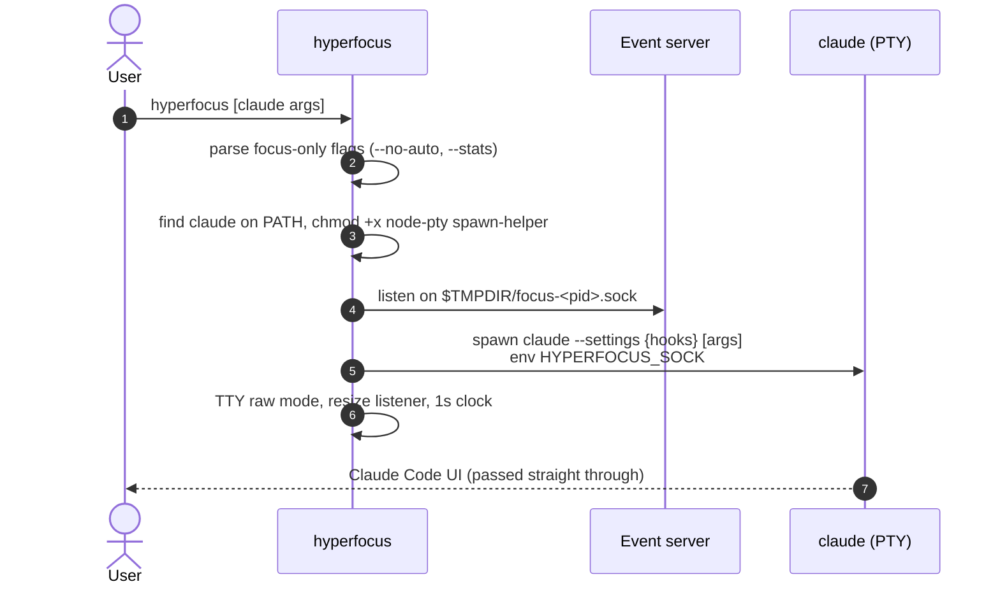

### One agent turn: auto-open, quiz, hand back

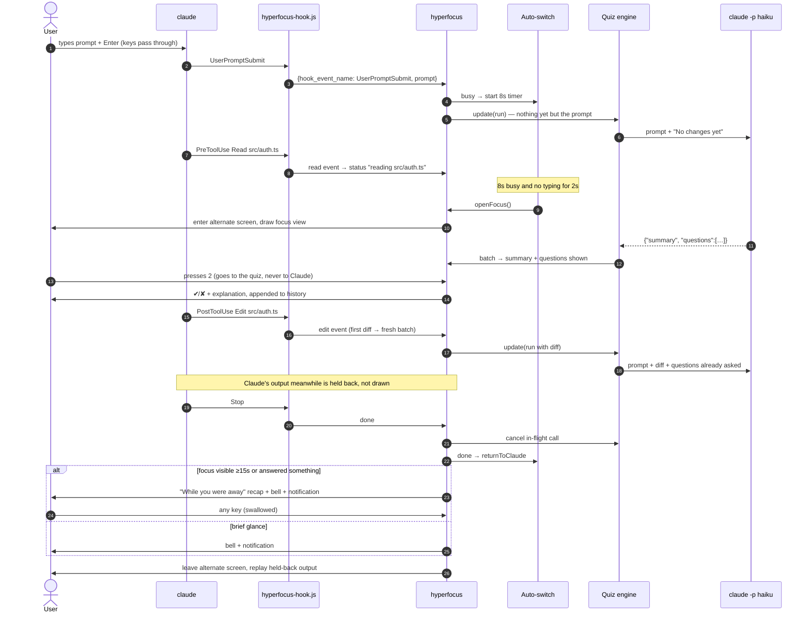

### Permission prompt in the middle of a turn

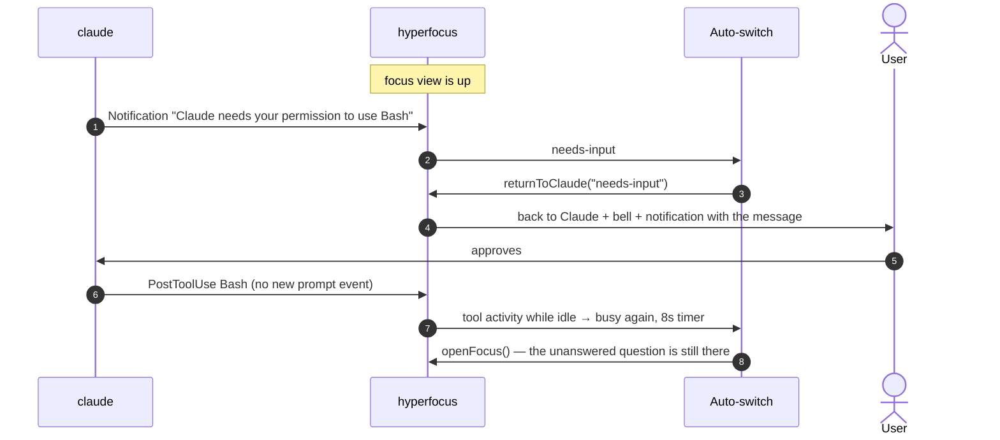

### Question generation

```mermaid
sequenceDiagram
    autonumber
    participant S as Focus session
    participant Q as Quiz engine
    participant M as claude -p

    S->>Q: update(run, {queuedQuestions})
    alt call in flight, run finished, or nothing to go on
        Q-->>S: (no-op)
    else the prompt, first diff, 3 new edits, or queue empty and something changed
        Q->>M: the warm process if one waits, else spawn in an empty folder:<br/>HYPERFOCUS_CHILD=1, MAX_THINKING_TOKENS=0, --tools "" --strict-mcp-config,<br/>disableAllHooks, stream-json in and out
        Q->>M: one stream-json user message: brief + prompt + diffs + context
        loop text deltas
            M-->>Q: partial reply
            Q->>Q: each question object closed so far → validate → shuffle → source
            Q-->>S: emit batch {summary: '', questions: [one]}
        end
        M-->>Q: result line
        alt nothing readable and nothing streamed
            Q->>M: retry once
        end
        Q-->>S: emit batch {summary, questions not yet emitted}
        Q->>M: start the next process now; it waits for stdin without calling the model
    end
    Note over Q,M: run ends / idle 5 min: the warm process's stdin is closed and it is killed, unused
```

Why stream-json for input too: with plain stdin, `claude -p` gives up after 3 s without data ("no stdin
data received in 3s"), so a process can't be started before its prompt is known. With
`--input-format stream-json` it waits; measured on Claude Code 2.1.288, a warm process answered 0.7 s
after its prompt against 1.4 s cold.

The **project brief** is built once per repository and HEAD, in the background from the session's
start. A prompt checks HEAD (one `git rev-parse`) and rebuilds when it moved; questions never wait for
it. The first call of a run is made at the prompt, with the brief, and asks about the plan for that
prompt; each such question carries the prompt as its `plan` source.

**Spaced repeats.** When a reply's last batch arrives with new questions, the session adds at most one
missed question that is due again (`history.dueRepeats`: 1, 3, 7 days) and whose code is still there.
It is marked `repeat`, so its answer is recorded with `source: "repeat"`.

### Screen switch mechanics

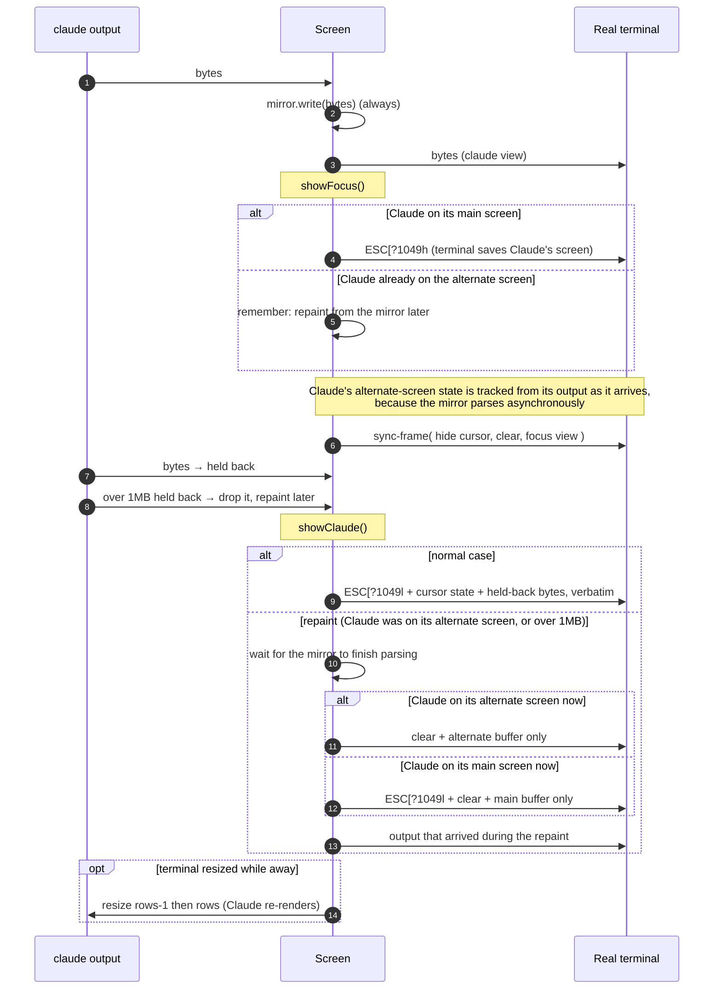

## State machines

### Screen and auto-switch

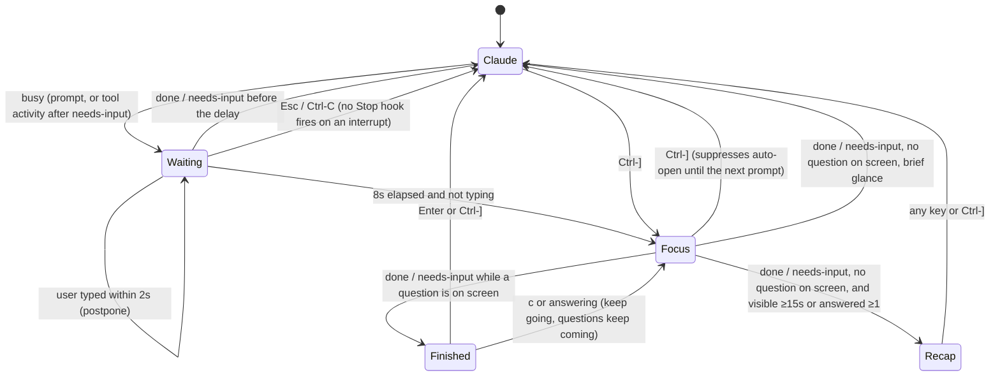

### Focus view

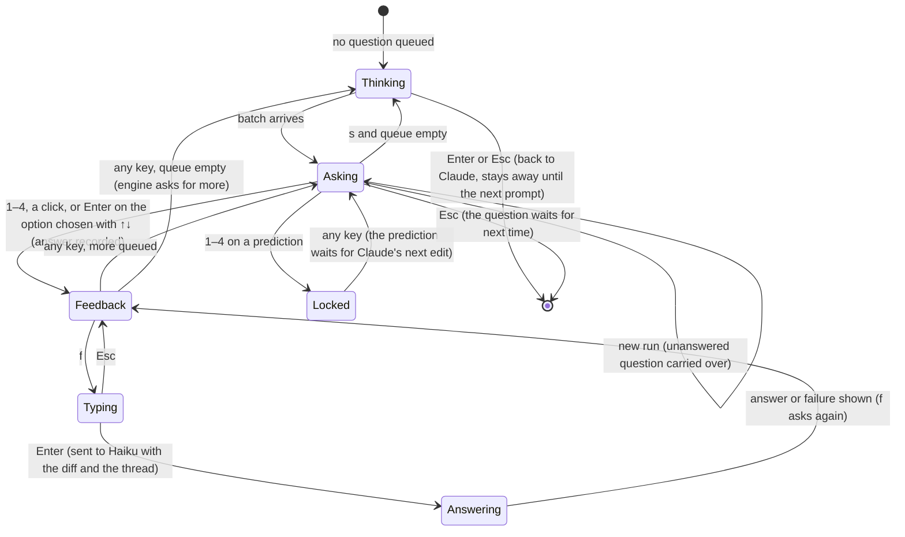

## Data model

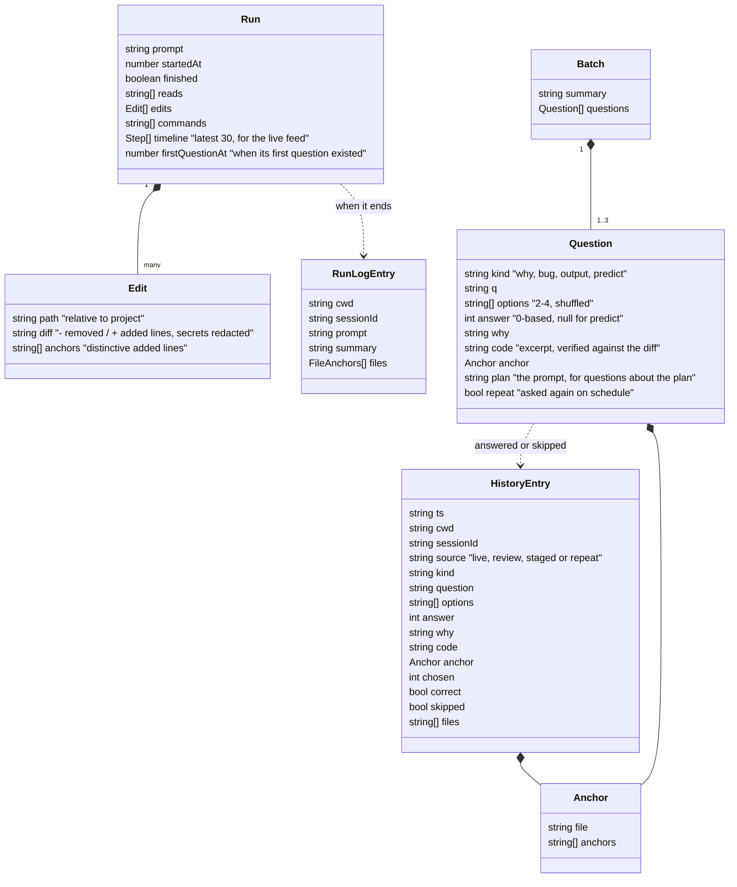

Every file format here is versioned and frozen within 1.x; see [`FORMATS.md`](FORMATS.md).

Size limits keep the quiz call small and cheap: a diff is capped at 4KB per edit and 20KB per
run, and the **oldest** diffs are dropped first. Every edited file stays listed, with its diff
replaced by `(older change omitted)`.

## The panel bridge

The VS Code extension shows the live session and can answer for the user. hyperfocus stays the only
thing that calls a model or decides quiz state; the panel renders what it is sent and sends back
what the user did.

```mermaid
sequenceDiagram
    participant P as VS Code panel
    participant D as ~/.hyperfocus/sessions/
    participant B as Bridge
    participant S as Focus session / view
    participant T as Terminal
    B->>D: <pid>.json { protocol, pid, cwd, agent, endpoint, startedAt }
    P->>D: watch; pick the session for this folder
    P->>B: connect
    B-->>P: hello { protocol: 1, pid, cwd, agent }
    B-->>P: state (snapshot)
    P->>B: answer { id, chosen }
    B->>S: act(answer) — same code path as the key
    S->>T: redraw
    B-->>P: state (feedback)
    Note over T,B: a key in the terminal redraws, and the redraw publishes to the panel too
```

- **Discovery.** Each session writes `sessions/<pid>.json` in the data folder and removes it on exit.
  A file whose process is gone is ignored; hyperfocus's own `listSessions` also deletes it, the
  extension only skips it.
- **Transport.** A second local endpoint: on Unix a socket in a fresh `0700` temp directory (so no
  other user can connect, even before the socket's own mode is set), a named pipe on Windows.
  Newline-delimited JSON both ways; any number of clients. A client that sends a line over 64KB is
  dropped, and a follow-up is cut to 500 characters.
- **State.** `focus-view` `snapshot()` (question with its id and anchor, feedback, thread, score,
  agent status, finished) plus the run from the session and the quiet flag. The answer and why are
  only sent after the user has answered. Every string goes through `redact.js`. State is sent on
  connect and after every redraw, only when it changed.
- **Actions.** `answer`, `skip`, `next`, `save`, `rate`, `followUp`, `keepGoing`, `back`, `exit` (Esc), `quiet`,
  through `focus-view` `act()`, which shares its code with the keys and follows the same rules (for
  example, only answering, skipping, keep going and back work while "agent finished" is up). An
  action naming a question id that is no longer up gets `{ type: 'stale', id }`.
- **Who asks.** A client sends `{ type: 'watching', visible }` whenever its panel is shown or hidden.
  While any panel is on screen, the automatic switch to the quiz is skipped: the terminal stays on the
  agent and the panel asks. When the agent finishes mid-question, the "finished" choice is set for the
  panel, without the terminal bell. `Ctrl-]` still opens the quiz in the terminal.
- **Versioning.** `protocol` is in the session file and the hello; a client that doesn't know the
  number says which hyperfocus it needs instead of guessing.

### `--staged`

The same bridge with no agent and no terminal UI. The staged diff is parsed into one edit event per
file (a change per hunk) and replayed into a focus session in one go, so the first question call sees
the whole change. When the batch arrives the run is closed, so the engine asks nothing more. The
session file's agent is `staged`; `back` ends the review (there is no agent to go back to). It also
ends when the user has gone past the last question, when the panel that was following it
disconnects, or after two minutes with no questions.

### The extension (`vscode/`)

Plain CommonJS, no bundler. Everything that decides something is free of the `vscode` module and
tested with node:

| Module | Responsibility |
| --- | --- |
| `live.js` | finds the session for the window (session files, polled), connects with backoff, refuses unknown protocols, keeps the latest state |
| `panel-state.js` | session choice; state → live card and controls (the same rules as the keys); status bar text; the "agent finished" edge; anchor → line range (the half-the-lines rule); gutter marks from history; the start command and PATH lookup |
| `views.js` | the webview HTML in three states (idle: what it is and Start; working: the question; your progress underneath once there is some), the live card and the rest replaced in place by message so scroll, open sections and a half-typed follow-up survive |
| `data.js` | stats, weak spots, missed and saved questions from the JSONL files |
| `extension.js` | VS Code wiring only: webview, tree, status bar, decorations, commands, watchers |

The extension never calls a model. The staged review is the CLI started with `--staged`; the panel
then finds it like any other session.

## Is it still in the code?

The user can steer Claude from change X to change Y halfway through. Questions about X, and notes
about X, then describe code that no longer exists. hyperfocus never asks git or guesses intent; it
checks the code itself:

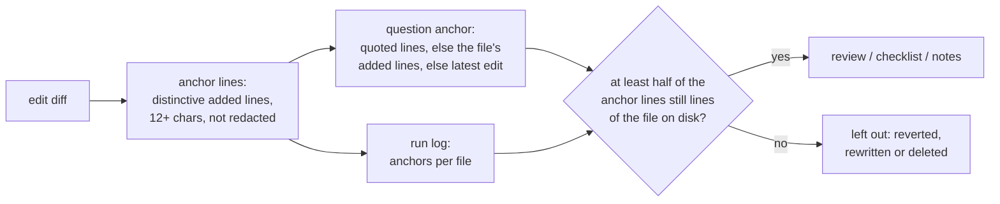

- Questions asked before any edit have no anchor, and old history entries don't either: neither is
  ever brought back, because neither can be checked.
- Used by the end-of-run "worth a look before you merge" checklist, `hyperfocus --review` (latest
  attempt wrong, still in the code) and `hyperfocus --notes` (files and runs whose changes are gone are
  left out, and the notes say how many).
- Whitespace changes don't matter (lines are compared trimmed); a moved line still counts.

## Terminal handling

- **Raw mode** is on for hyperfocus's whole lifetime and is restored on exit, crash or signal
  (`process.on('exit')`).
- **Alternate screen (`?1049`)** holds the focus view, so Claude's main screen and scrollback are
  never drawn over.
- **Replay beats repaint.** Claude Code draws its UI with relative cursor movements. Replaying its
  bytes exactly is the only way to keep its own idea of the screen correct, so the headless mirror is
  only a fallback for when Claude itself was on the alternate screen.
- **Ctrl-] detection** accepts `0x1d`, kitty (`CSI 93;5u`) and modifyOtherKeys (`CSI 27;5;93~`),
  because Claude Code turns on enhanced keyboard modes. The key is found anywhere in an input chunk,
  since fast typing and pastes merge keys into one chunk.
- **Mouse (`?1000` + `?1006`)** is turned on only while the focus view is up, and Claude's own mouse
  modes, tracked from its output, are restored on the way back. Clicks act only on option rows, since
  the click that focuses the terminal window arrives too.
- **Synchronized output (`?2026`)** wraps every focus frame, so terminals that support it don't flicker
  on the 1-second clock redraw.
- **Piped mode:** if stdin or stdout isn't a TTY, hyperfocus runs `claude` with inherited stdio and does
  nothing else.

## Failure handling

| Failure | Behaviour |
| --- | --- |
| `claude` not on PATH | clear message, exit 127 |
| node-pty `spawn-helper` shipped without +x | fixed at startup (`spawn-helper-permissions.js`) |
| user interrupts Claude with Esc / Ctrl-C | Claude Code sends no `Stop` hook, so the key press itself ends the run and cancels the pending switch |
| Claude prints a lot while the focus view is up | past 1MB of held-back output, it is dropped and Claude's current screen is repainted from the mirror on return |
| malformed hook payload | fields are checked and bad payloads dropped; handler errors are caught so they can't kill the session |
| hyperfocus exits unexpectedly | the exit handler always switches the terminal back to Claude's screen |
| hyperfocus not listening / socket missing | hook exits 0 in milliseconds, prints nothing |
| hook takes too long | the hook script gives up after 500ms; Claude's hook timeout is 5s |
| quiz model returns prose or broken JSON | one retry, then skip that batch quietly |
| quiz model API error | no retry; the view keeps showing the summary and "Thinking of a question…" |
| model returns some malformed questions | those questions are dropped, the rest are kept |
| agent finishes mid-call | the call is killed and its result ignored |
| the panel bridge can't start, or a client sends junk | logged with `HYPERFOCUS_DEBUG=1`; the terminal works as before, nothing a client sends can throw into the session |
| a session file is left by a crashed hyperfocus | its pid is dead, so readers ignore and delete it |
| history or run log can't be written | logged with `HYPERFOCUS_DEBUG=1`; the session carries on |
| bad value in `config.json` | printed once at startup; that setting falls back to its default |
| the model quotes code that isn't in the diff | the excerpt is dropped; a "bug" or "output" question without one is dropped |
| a diff or command contains a secret | token formats and secret-looking assignments are replaced with `[redacted]` before storing, showing or sending; `.env`, keys and similar files never have their contents read |
| hyperfocus-spawned `claude -p` would trigger hooks | `HYPERFOCUS_CHILD=1` makes our hook a no-op, and `disableAllHooks` stops the user's hooks while their settings (and auth) still load |

## Testing strategy

Tests sit at eight agreed seams, all behind public interfaces:

1. **Hook → socket → events:** the real hook script against a real socket.
2. **Activity log:** fed recorded hook payloads through the same translation the server uses.
3. **Quiz engine:** against a stub `claude` binary (`test/fixtures/fake-haiku.js`) that records its
   argv, env, working folder and prompt, speaks stream-json, can pause mid-reply, and logs every
   process start, so the empty folder, streaming and the warm call (used, or closed unused) are all
   observable. The **project brief** is tested the same way, against temporary git repositories; the
   **Ollama writer** against a fake Ollama HTTP server.
4. **Auto-switch policy:** with `node:test` mock timers.
5. **Focus view and recap:** rendering as a function of state and size, plus key handling.
6. **History, `--stats`, `--notes` and the still-in-the-code check:** against temporary files and a
   stub file reader.
7. **The panel bridge:** a fake panel client on a real socket against a real focus session (with the
   stub model for follow-ups): snapshot, actions, staleness, several clients, redaction, session files;
   and `--staged` the same way, plus once through the real binary in a temporary git repo.
   On the extension side, its vscode-free modules are tested with node, and its connection is tested
   against the CLI's real bridge.
8. **End to end in a PTY:** `hyperfocus` runs inside an outer pseudo-terminal against
   `test/fixtures/fake-claude.js`, which reports what it receives and can run the injected hook
   commands the way Claude Code would.

On top of that, hyperfocus was run against real Claude Code 2.1.285 in a throwaway project: auto-open,
a generated question, an answer, two real `Write` hooks, `Stop`, the recap and an intact return. For
0.2.0 it was run again: Claude's `TaskCreate`/`TaskUpdate` plan, the live feed, the peek, the finish
prompt, the run log and `--notes` with a reverted file; `--review` was run in a PTY against seeded
history with one kept and one discarded question.

## Design decisions

| Decision | Chosen | Rejected, and why |
| --- | --- | --- |
| Where the quiz lives | wrapper that owns the terminal | second window (people won't switch views); a new frontend on the Agent SDK (would mean rebuilding Claude Code's UI) |
| Seeing agent activity | hooks via `--settings` | parsing the transcript JSONL (lags, undocumented format); editing `settings.json` (touches user config) |
| Hook → hyperfocus transport | unix socket, one line per payload | file tailing (polling, cleanup); HTTP (a port to manage) |
| Panel ↔ hyperfocus | a second socket per session, found through a session file; actions go through the same code as keys | the panel calling the model itself (two quiz engines, two cost stories); a port (firewall prompts, other users on the machine); sending keystrokes (breaks when the intro or a draft is up) |
| Screen switching | alternate screen + byte replay | always repainting from the mirror (drifts from Claude's own screen model) |
| Question model | `claude -p --model haiku`, lean flags, no thinking, user settings kept for auth | Anthropic SDK (needs an API key the user may not have); default flags (~21k context tokens, ~30s with thinking) |
| When to ask again | the prompt, first diff, every 3 edits, or when the queue is empty | one call per event (cost, noise) |
| Project knowledge for questions | a cached brief (README, CLAUDE.md/AGENTS.md, manifests, tree, commits) written once per HEAD; question calls run in an empty folder | running the writer in the project (it loaded CLAUDE.md and the agent's memory: ~1,300 tokens, and questions about "your memory notes"); `--bare` (skips the keychain, breaks Pro/Max logins); reading code files in the background (cost grows with the repo) |
| Getting the first question sooner | stream the reply and emit each question when it closes; keep the next process warm | smaller batches (more start-ups); a long-lived conversation process (would carry earlier runs' context) |
| Repeats | spaced 1/3/7 days, at most one per batch, only while the code is there | a separate review mode only (people don't run it) |
| Local model | Ollama's HTTP API as a writer that replaces the process | bundling a model; llama.cpp directly (setup burden) |
| Filling the wait for the first batch | a question at the prompt, from the prompt and the brief; the live view one key away; due repeats join new questions, never replace them | replaying old missed questions on their own (they may be about a change the user has since abandoned; repeats are checked against the code) |
| Live view on screen | hidden by default, `l` toggles, `"live": true` to start open | always on (noise under every question) |
| Telling kept changes from discarded ones | anchor lines checked against the file on disk | git history (not every project, uncommitted work); asking the user |
| Answer position | shuffled locally | trusting the model (it favours one slot) |
| When the quiz opens (0.3) | busy for `delayMs` and something to ask about: an edit or a 2+ step plan; half the wait for 3+ steps; a second edit in projects whose median run is short; after 30 s busy, open regardless (exploration runs can go minutes without an edit) | a fixed delay (quizzes about nothing, yanked back seconds later); guessing from the prompt's wording (unexplainable silent skips) |
| Silencing the quiz | `z` twice, `--quiet`, per-project `quiet` | a single `z` (stray typing in the wrong screen silenced sessions, like `q` did for exit) |
| Context for questions | ±10 lines around each of the last 3 edits' anchor lines, 100 lines max, redacted | whole files (cost, secrets); the diff only (shallow "why" questions) |
| Bad questions | `b` writes `rating: "bad"`; every reader drops that question | deleting history lines (append-only log) |
| Concept tags | 12 fixed tags, unknown ones dropped | free text (unreadable stats within a week) |
| Streak | consecutive days with an answer | sessions (history only records sessions with answers, so every session is "in a row") |
| Other agents | one adapter each; Codex through a mirrored `CODEX_HOME` with a stable path (so hook trust sticks), Gemini through a copied system settings file | editing `~/.codex/hooks.json` or `~/.gemini/settings.json` (touches user config, leaks on crash); `--dangerously-bypass-hook-trust` (would also run untrusted repositories' hooks) |
| Demo | a stand-in agent that fires the real hooks, writes real files in a temp project, and answers `-p` with canned JSON | special demo code paths in the app (the demo would stop showing the real thing) |
| Language | plain Node ESM, JSDoc types checked by `tsc` | TypeScript build step (slower hook startup, more tooling) |

## Known limitations

- **Linux:** node-pty 1.1.0 ships prebuilt binaries only for macOS and Windows, so on Linux it
  compiles on install (needs `python3`, `make` and a C++ compiler). Desktop notifications are
  macOS-only; the bell works everywhere.
- **Windows (experimental):** a named pipe replaces the unix socket, `claude.cmd` is started as node plus its script (no cmd.exe quoting), and the PTY is killed without signals. Only CI has run it. Open questions for a real machine: whether ConPTY passes Claude's escape sequences through unchanged (the replay depends on it), whether mouse reports and Ctrl-] arrive in raw mode, and which shell Claude Code runs hook commands with.
- **One session:** hyperfocus follows only the Claude process it started.
- **Replay after a resize while away:** held-back output was laid out for the old size. The resize
  nudge makes Claude re-render, but a brief glitch is possible.
- **Transcript and context:** the quiz model sees at most about 20KB of diffs per run, not the whole
  conversation.
